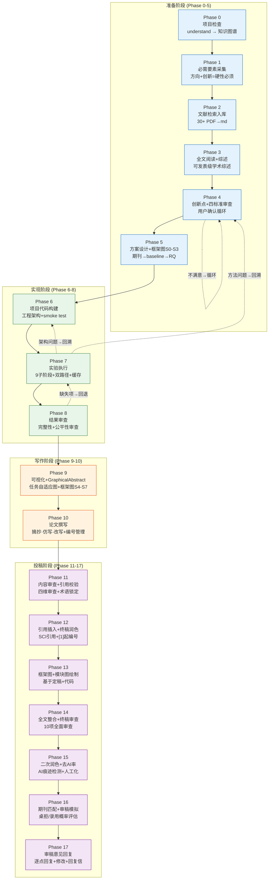

# 论文工作流 v5.0 · 对话式 · 18 Phase

> **版本**：v5.0 · 2026-06-27 · 最终版
> **设计理念**：对话式引导，非自动化流水线。AI 是合作者，不是 checklist 执行器。
> **适用范围**：CV / NLP / LLM / KG / Medical AI / PHM / Time Series / RL / Speech / Tabular ML
> **框架无关**：PyTorch / TensorFlow / JAX / NumPy 均可
> **基于**：工作流问题记录 v1.0 全量实测 + 假设测试

---

## 全局规则

1. **对话式，非流水线**：Phase 松耦合，用户可任意跳转、回溯、跳过。AI 提问引导，不强制执行门禁。
2. **每 Phase 结束强制工作记录**：自动保存到 `docs/项目工作阶段记录/Phase{N}_{name}.md`。
3. **技能按需调用**：每个 Phase 列出推荐技能，AI 根据实际情况选用。
4. **用户确认是关键节点**：重大决策（创新点确认、实验范围、投稿）必须经用户确认。
5. **Stubs 优于中断**：依赖缺失自动 fallback，不中断流程。
6. **目录约束**：所有产物保存在 `docs/` 子目录下，严禁散落根目录。

---

## 工作流 Mermaid 图



---

## Phase 总览

| Phase | 阶段 | 名称 | 核心产出 | 关键技能 |
|-------|------|------|---------|---------|
| 0 | 准备 | 项目检查 | 代码知识图谱 | understand |
| 1 | 准备 | 必需要素采集 | 方向+创新确认 | 对话 |
| 2 | 准备 | 文献检索入库 | >=30篇 PDF→md | nature-reader, nature-academic-search |
| 3 | 准备 | 全文阅读+综述 | 可发表级学术综述 | nature-reader, nature-writing |
| 4 | 准备 | 创新点+四标准审查 | 审查通过的创新点 | nature-writing, academic-research, world-model |
| 5 | 准备 | 方案设计+框架图S0-S3 | RQ+baseline+协议+草图 | nature-academic-search, nature-writing |
| 6 | 实现 | 项目代码构建 | 工程架构+smoke | codebase-design, understand, karpathy |
| 7 | 实现 | 实验执行 | 全量实验数据 | python-expert, world-model |
| 8 | 实现 | 结果审查 | 审查报告+checklist | world-model, Understand-Anything |
| 9 | 写作 | 可视化+GraphicalAbstract | 出版级图表+图画摘要 | nature-figure, scipilot-figure, paper-framework |
| 10 | 写作 | 论文撰写 | 完整初稿 | nature-writing, paper-craft |
| 11 | 投稿 | 内容审查+引用校验 | 审查报告+术语表 | academic-research, world-model, paper-craft |
| 12 | 投稿 | 引用插入+终稿润色 | SCI引用插入+定稿 | nature-writing, nature-polishing, paper-craft |
| 13 | 投稿 | 框架图+模块图绘制 | 最终框架图+模块详图 | paper-framework, scipilot-figure, nature-figure |
| 14 | 投稿 | 全文整合+终稿审查 | 10项审查通过+投稿包 | paper-craft, academic-research, world-model |
| 15 | 投稿 | 二次润色+去AI率 | 去AI终稿 | paper-craft, nature-polishing |
| 16 | 投稿 | 期刊匹配+审稿模拟 | 录用概率+改进建议 | academic-research, world-model |
| 17 | 投稿 | 审稿意见回复 | 逐点回复+修改稿+回复信 | nature-response, academic-research |

---

## 技能库总索引

### 技能等级

| 等级 | 技能群 | 用途 |
|------|--------|------|
| **L9** | nature-skills | 论文写作/调研/绘图/润色/引用/审稿回复 全链路 |
| **L9** | Understand-Anything | 代码深度理解（知识图谱/问答/差异/解释） |
| **L8** | architecture-engineering | 代码质量把控（设计/建模/审查/测试） |
| **—** | world-model-method | 全局统筹/决策/审查 |
| **—** | paper-framework-figure-studio-pro | 论文框架图 v3.1.4a |
| **—** | karpathy-guidelines | 代码质量准则（全局注入） |
| **—** | paper-craft-skills | 论文工艺（结构/摘抄/仿写/术语/AI检测） |
| **—** | academic-research-skills | 学术研究规范（内容审查/期刊匹配/审稿模拟） |
| **—** | scipilot-figure-skill | 科学图表辅助（模块图/配色/布局） |

### 技能 × Phase 完整映射

| Phase | nature-skills | Understand-Anything | arch-engineering | world-model | paper-framework | paper-craft | academic-research | scipilot-figure |
|-------|:---:|:---:|:---:|:---:|:---:|:---:|:---:|:---:|
| 0 | | ● | | | | | | |
| 1 | | | | | | | | |
| 2 | ● | ● | | | | | | |
| 3 | ● | | | ○ | | | | |
| 4 | ● | | ○ | ● | | | ● | |
| 5 | ● | | | ● | ●(S0-S3) | | | |
| 6 | | ● | ● | ○ | | | | |
| 7 | | | | ● | | | | |
| 8 | | ● | ● | ● | | | | |
| 9 | ● | | | ○ | ●(S4-S7) | | ○ | ● |
| 10 | ● | | | ○ | | ● | | |
| 11 | ● | | | ● | | ● | ● | |
| 12 | ● | | | | ○ | ● | | |
| 13 | ● | ● | | ○ | ● | ○ | | ● |
| 14 | ● | | | ● | ○ | ● | ● | |
| 15 | ● | | | | | ● | | |
| 16 | ● | | | ● | | ○ | ● | |
| 17 | ● | | | ○ | | ● | ● | |

> ● = 主要使用  ○ = 辅助使用

---

## 技能路径索引

```
D:\Skills\
├── nature-skills-main.zip                           ← L9  Nature 出版工具 9合1
│   ├── nature-reader        论文深度阅读+中英对照
│   ├── nature-academic-search  多源文献检索(PubMed/CrossRef/arXiv/WoS/Scopus)
│   ├── nature-writing        Nature风格学术写作
│   ├── nature-figure         出版级图表(Python/R)
│   ├── nature-polishing       Nature风格三层润色
│   ├── nature-citation       Nature/CNS严格引用校验
│   ├── nature-data           FAIR数据可用性声明
│   ├── nature-paper2ppt      论文转PPT演示
│   └── nature-response       逐点审稿意见回复
│
├── Understand-Anything-main.zip                      ← L9  代码理解 9合1
│   ├── understand            代码知识图谱生成
│   ├── understand-chat       知识图谱问答
│   ├── understand-dashboard  仪表板可视化
│   ├── understand-diff       代码差异分析
│   ├── understand-domain     领域知识抽取
│   ├── understand-explain    深度代码解释
│   ├── understand-knowledge  LLM Wiki知识图谱
│   ├── understand-onboard    项目入门指南
│   └── diagnosing-bugs       硬Bug诊断循环
│
├── skills-main.zip                                    ← L8  架构&工程
│   ├── codebase-design       深度模块设计
│   ├── domain-modeling       领域模型+术语表
│   ├── grilling              需求盘问stress-test
│   ├── grill-me              多视角追问
│   ├── grill-with-docs       ADR+复盘
│   ├── improve-codebase-architecture  架构扫描→HTML报告
│   ├── tdd                   测试驱动开发
│   ├── diagnosing-bugs       Bug诊断
│   └── resolving-merge-conflicts  合并冲突解决
│
├── world-model-method-main.zip                       ← 全局统筹
├── paper-framework-figure-studio-pro-main.zip         ← 框架图
├── paper-framework-figure-studio-pro-v3.1.4a-skill.zip ← 框架图 v3.1.4a
├── paper-craft-skills-main.zip                        ← 论文工艺
├── academic-research-skills-main.zip                  ← 学术研究技能
├── scipilot-figure-skill-main.zip                     ← 科学图表辅助
├── andrej-karpathy-skills-main.zip                    ← Karpathy代码准则
├── codegraph-main.zip                                 ← 代码图谱
├── codex-plusplus-main.zip
├── gsap-skills-main.zip
├── shushu-internship-tool-main.zip
└── skills-main.zip                                    ← 通用技能包
```

---

## Phase 详细设计

### Phase 0：项目检查

**目标**：搞清楚"我现在有什么"。

**流程**：
1. 扫描项目目录结构和所有文件
2. 有代码 → 使用 `understand` 生成代码知识图谱；无代码 → 记录"项目为零起点"
3. 向用户汇报结构化摘要：项目类型/任务类型/数据集/核心模型/参考来源/缺失项

**产出**：`.understand-anything/`、`docs/项目工作阶段记录/Phase0_项目检查.md`

**技能**：`Understand-Anything`（understand）

---

### Phase 1：必需要素采集

**目标**：确认用户知道自己要做什么。

**流程**：AI 逐项询问——

| 问题 | 要求 |
|------|------|
| "研究方向？" | **硬性必须** |
| "创新点？" | **硬性必须** |
| "参考论文？" | 强烈推荐 |
| "参考代码？" | 强烈推荐 |

用户说不清楚 → AI 帮理清思路，不能跳过。

**产出**：`docs/项目工作阶段记录/Phase1_要素采集.md`

---

### Phase 2：文献检索与入库

**目标**：建立 >= 30 篇的 md 文献库。

**流程**：
1. 审查用户提供的内容
2. nature-reader 解析用户提供的论文 → .md
3. 如有参考代码 → understand 生成知识图谱
4. nature-academic-search 多源检索（>= 30 篇）
5. 对话：手动下载 or 自动下载？
6. PDF → md（硬性要求：双栏/单栏兼容 + 全文文字 + 图表完整 + 参考文献逐条保留）
7. 文献入库 `docs/参考文献/*.md`

**产出**：`docs/参考文献/*.md`(>=30篇)、`docs/{Project}_BibTeX.bib`

**技能**：`nature-reader`、`nature-academic-search`、`understand`

---

### Phase 3：全文阅读与综述生成

**目标**：读完全部 md 文献，生成可发表级学术综述。

**硬性约束**：全部 md 全文读取（非摘要/非抽样）。如果 >30 篇超出上下文 → 分批：每 10 篇一批，分批产分段综述，最后合并。

**流程**：
1. nature-reader 逐篇深度阅读 → 提取：问题/方法/创新/实验/结论/局限
2. nature-writing 整合 → 按主题/方法/时间线多维度组织
3. 标注每篇 gap 和贡献
4. 保存 `docs/综述/学术综述.md`

**产出**：`docs/综述/学术综述.md`

**技能**：`nature-reader`、`nature-writing`、`world-model-method`(可选)

---

### Phase 4：创新点识别与审查

**目标**：基于综述 gap，识别真正的创新点，严格审查。

**流程**：
1. 基于综述生成创新点（>= 1 条真实即可，不追求数量）
2. 多技能交叉验证 → 四标准审查
3. 生成审查报告
4. 用户确认循环（不满意 → 改 → 再审 → 循环直到满意）

**四标准审查**：

| 审查项 | 标准 | 不达标 |
|--------|------|--------|
| 模块堆砌检测 | A+B+C 拼凑 or 本质新机制？ | 直接退回 |
| 真实创新性 | 与现有工作本质区别？ | 退回 |
| SCI/JCR 二区以上水准 | 对标目标期刊近 2 年论文的创新幅度 | 退回 |
| 实验可实现性 | 算力/数据/复杂度合理？ | 退回 |

**产出**：`docs/创新点表.md`、`docs/创新点/审查报告.md`

**技能**：`nature-writing`、`academic-research-skills`、`world-model-method`、`domain-modeling`、`grilling`

---

### Phase 5：方案设计 + 框架图 S0-S3

**目标**：把创新点落地为可执行的实验方案。

**流程**：
1. 期刊推荐（nature-academic-search 多准则打分 → Top-5 + 改投代价）
2. Baseline 清单（从综述提取 SOTA 方法）
3. 实验协议正式化（数据集/split/seeds/显著性检验/成功判据）
4. RQ 定义（nature-writing 驱动，对齐目标期刊风格）
5. 验证方案设计（每个假设 → 实验 + ablation + 预期结果）
6. 目标期刊对齐审查
7. 多技能审查 + 用户确认
8. ★ 框架图 S0-S3（paper-framework-figure-studio-pro）

**框架图 S0-S3**：
- S0：建立项目状态，确认材料/画幅
- S1：诊断读者问题、figure 角色、核心创新点
- S2：生成 6-8 张低保真手绘草图（快速迭代确认架构合理性）
- S3：选择最强方向 → 用户确认

**产出**：`docs/journal_profile.md`、`docs/baseline_清单.md`、`docs/实验协议.md`、`docs/RQ.md`

**技能**：`nature-academic-search`、`nature-writing`、`world-model-method`、`academic-research-skills`、`paper-framework-figure-studio-pro`(S0-S3)

---

### Phase 6：项目代码构建

**目标**：按真实工程架构构建项目代码。

**核心原则**：工程架构优先 + 有参考项目则参考 + 模块化/可测试/可配置。

**流程**：
1. 架构设计（分析参考项目 → codebase-design 设计模块）
2. 项目骨架（目录结构 + config + .gitignore + git init）
3. 核心模块实现（数据管线 + 模型 + Trainer + 评估，karpathy 把关）
4. Baseline 实现（逐个实现，缺失依赖 stub）
5. Smoke Test（forward+backward 通过）
6. Work record

**工程项目结构**：
```
{project}/
├── models/  configs/  data/  train/  eval/
├── baselines/  utils/  experiments/  tests/  docs/
```

**产出**：完整项目代码、smoke test PASS

**技能**：`understand`、`codebase-design`、`andrej-karpathy-skills`、`codegraph`、`world-model-method`

---

### Phase 7：实验执行

> 整个工作流中耗时最长、最关键的阶段。

**入口对话**：公开 benchmark？自有数据集？公开数据+自定义协议？

**子阶段**：

| 子阶段 | 名称 | 优先级 | 论文对应 |
|--------|------|--------|---------|
| 7A | 实验设置 | P0 | Experimental Setup |
| 7B | 主实验结果 | P0 | Main Results |
| 7C | 消融实验 | P0 | Ablation Studies |
| 7D | 超参敏感度 | P1 | Hyperparameter Analysis |
| 7E | 鲁棒性分析 | P0 | Robustness |
| 7F | 泛化实验 ★ | P0(跨数据集)/P1(其他) | Generalization |
| 7G | 效率分析 | P1 | Efficiency |
| 7H | 定性分析 | P1 | Qualitative Analysis |
| 7I | 汇总出表 | P0 | Tables & Figures |

**泛化实验（7F）**：

| 类型 | 操作 | 优先级 |
|------|------|--------|
| 跨数据集 | A训→B测 | **P0 必须** |
| 跨场景 | 场景1→场景2 | P1 |
| 少样本迁移 | 10%/25%/50% finetune | P1 |
| 跨时间/跨传感器 | 视数据 | 可选 |

**控制台输出规范**（参考 RSN 项目 phase7_std.txt）：

- 总横幅：`╔══ P H A S E   7 ══╗` + `████` 分隔
- 子阶段横幅：`╔══ PHASE 7A ══╗` + 实验数/模型列表
- 每 epoch：13 字段（TrainLoss/ValLoss/TrainAcc/ValAcc/ValF1/BestValAcc/LR/EpTime/Total/ETA/GPU）
- 实验完成：12 字段（BestEp/TestAcc/TestF1/Precision/Recall/Params/FLOPs/TrainTime/AvgEpTime/Latency/EarlyStop）
- 中期排名表：ASCII 表格
- stdout 双写：控制台 + `logs/{sub}_{ts}.stdout/.jsonl`
- 错误日志：追加写入 `logs/{sub}_errors.log`

**数据缓存机制**：首次 CSV 加载+特征提取 → 写入 `cache/*.npy`，后续改模型重跑 → 1.5s 缓存加载。

**防令牌烧毁**：>5min 任务后台启动 + ScheduleWakeup 轮询。

**回溯决策**：小修原地 / 架构回 Phase 6 / 方法回 Phase 4。

**产出**：`results/phase7_full.json`、`results/tables/*.tex`、`results/phase7_figure_data.json`、`logs/`

**技能**：`python-expert`、`world-model-method`

---

### Phase 8：结果审查与复现验证

**目标**：在写论文前确认结果站得住。**不再跑实验**。

**流程**：
1. 结果完整性检查 → FAIL 时自动生成回退清单（映射到 Phase 7 子阶段）
2. 代码扫描（8 项标准 checklist：死代码/数据泄漏/配置一致性/硬编码路径/种子固定/训练测试分离/标签泄漏/数据增强一致性）
3. 公平性审查（baseline 调参？同等条件？过拟合？cherry-pick？已发表对比？）→ 每个 WARN/FAIL 附具体建议
4. Checklist 归档
5. 用户确认（每个 WARN/FAIL 给选项：接受/回退修复/标注理由跳过）

**产出**：`results/复现_checklist.md`、`results/审查报告.md`

**技能**：`world-model-method`、`Understand-Anything`、`improve-codebase-architecture`、`grilling`

---

### Phase 9：可视化与 Graphical Abstract

**流程**：
1. 任务类型检测 → 自动匹配图清单（分类/回归/检测/分割/生成各不同）
2. nature-figure + scipilot-figure 生成结果图（三格式 + 期刊风格）
3. 每张图生成 Graphical Abstract（写入正文的图像描述）→ 保存到 `docs/figure/fig{N}/fig{N}_graphical_abstract.md`
4. 框架图 S4-S7（S4:候选简报 → S5:正式候选 → S6:选择 → S7:审计 PASS）
5. 期刊风格审查 + caption 检查

**Graphical Abstract 模板**：画面描述 + 核心发现 + 统计信息 + 正文引用段 + Caption

**门禁**：必须图 >= 4 张 + 框架图 S7 PASS + 期刊风格检查 PASS

**产出**：`docs/figure/fig{N}/*.{pdf,svg,png}`、`docs/figure/fig{N}/fig{N}_graphical_abstract.md`、`docs/figure/all_graphical_abstracts.md`

**技能**：`nature-figure`、`paper-framework-figure-studio-pro`(S4-S7)、`scipilot-figure-skill`、`academic-research-skills`、`paper-craft-skills`

---

### Phase 10：论文撰写

**流程**：
1. 图表布局 + 全局编号分配（Figure/Table/Equation 编号锁定 → `numbering_register.md`）
2. 参考文献全文挖掘：摘抄·仿写·改写
   - 摘抄：nature-reader 读全部 md 文献 → paper-craft 提取句式/短语/论证模式 → `摘抄库.md`
   - 仿写：摘抄库模板 × 真实实验数据 → 仿写草稿
   - 改写：去模板化 + 术语锁定 + 数字注入 → 改写定稿
3. 逐 section 撰写（Abstract/Intro/RelatedWork/Method/Experiments/Conclusion）
4. 全文组装 + 交叉引用校验（图/表/公式/引用/数据数字）
5. 一致性审查 + 用户确认

**硬性约束**：全部由 nature-writing 生成，数字从 Phase 7 JSON 注入，图表描述从 Graphical Abstracts 插入。

**产出**：`docs/论文/{Project}_Paper_v1.tex`、`docs/论文/numbering_register.md`、`docs/论文/摘抄库.md`

**技能**：`nature-writing`、`nature-reader`、`paper-craft-skills`、`academic-research-skills`

---

### Phase 11：内容审查 + 引用校验

**流程**：
1. ★ 论文内容审查（先审内容，再审格式）：
   - 创新点-实验-结论对齐审查
   - 论点-数据支撑审查（每个定量断言 vs Phase 7 JSON）
   - 逻辑链审查（Abstract→Intro→Method→Exp→Conclusion 自洽？）
   - 过度宣称检测（"SOTA""first""robust"→有数据支撑？）
2. 术语表提取 + 锁定（润色前锁死 LOCK 项）
3. 参考文献校验（>= 30 条或领域核心全覆盖）
4. 期刊特定 Checklist（先读 Author Guidelines）

**产出**：`docs/论文/内容审查报告.md`、`docs/论文/术语表.md`

**技能**：`academic-research-skills`、`paper-craft-skills`、`world-model-method`、`nature-citation`、`nature-reader`

---

### Phase 12：引用插入 + 终稿润色

**流程**：
1. 审查结果落地修改（逐条处理 Phase 11 的 FAIL/WARN）
2. ★ 参考文献正文插入：
   - 引用需求分析（扫描正文标记引用位置）
   - 引用匹配（从 md 文献库选 SCI 引用，SCI>会议>arXiv 优先级）
   - 按行文逻辑 [1] 起顺序编号，同篇复用同号
   - 插入正文 + refs.bib 重排
3. 引用-正文一致性校验
4. 最终润色（nature-polishing 三层，术语锁定下执行）

**产出**：`docs/论文/{Project}_Paper_final.tex`、`docs/参考文献/refs.bib`（按[1]~[N]排序）

**技能**：`nature-writing`、`nature-polishing`、`paper-craft-skills`、`academic-research-skills`

---

### Phase 13：框架图 + 模块图绘制

**流程**：
1. 全文深度理解（读取 Phase 0-12 工作记录 + 定稿 + 代码）
2. 框架图 S0-S7 完整流程（基于最终定稿重新走）
3. 模块详图绘制（scipilot-figure + nature-figure，每个核心模块 1 张）
4. 图表-正文交叉校验
5. 终稿图表嵌入

**模块图标准**：输入标注 + 内部结构 + 输出标注 + 关键公式 + 创新点标注

**产出**：`docs/figure/fig_framework_final.{pdf,svg,png}`、`docs/figure/fig_module_{1-N}_*.{pdf,svg,png}`

**技能**：`paper-framework-figure-studio-pro`、`scipilot-figure-skill`、`nature-figure`、`understand`、`paper-craft-skills`

---

### Phase 14：全文整合 + 终稿审查

**目标**：所有图和 Graphical Abstract 整合进正文，10 项全面审查。

**流程**：
1. 图表最终整合（所有 Graphical Abstract 嵌入正文对应位置）
2. 全文完整性审查（结构/章节/图表/公式/引用 是否缺漏）
3. 图表正确性审查（编号/标题/caption/交叉引用）
4. 参考文献正确性审查（逐条：存在？编号一致？条目完整？）
5. 参考文献顺序审查（[1]→[N] 首次出现顺序？同篇复用同号？）
6. 数据-正文一致性审查（最后一轮：每个定量数字 vs Phase 7 JSON）
7. 术语-公式-代码一致性（23 LOCK 项三方对齐）
8. 排版格式审查（期刊模板/页数/图表分辨率/字体/行距）
9. 投稿包生成
10. 最终审查报告 + 用户确认

**产出**：`docs/论文/{Project}_Paper_FINAL.tex/.pdf`、`docs/投稿/submission_package/`

**技能**：`paper-craft-skills`、`nature-reader`、`academic-research-skills`、`world-model-method`

---

### Phase 15：二次润色 + 去AI率

**流程**：
1. 二次润色判断（AI 自动评分：<10 跳过 / 10-20 针对性 / >20 全文重润）
2. 二次润色（条件执行）
3. ★ 去 AI 率：
   - AI 痕迹检测（7 项指标：冗余连接词/句式重复率/形容词堆砌/段尾总结句/被动比例/段首多样性/句长标准差）
   - 人工化改写（句式多样化 + 连接词自然化 + 被动平衡 + 段落结尾多样化）
4. 去 AI 后校验（改写后术语/数据/引用/图表 全部重新核对）
5. 最终投稿检查 + 用户确认

**AI 痕迹检测清单**：

| 特征 | 阈值 |
|------|------|
| 冗余连接词 | > 3/千词 |
| 句式重复率 | > 50% |
| 形容词堆砌 | > 5/千词 |
| 段尾总结句 | > 50% |
| 被动语态 | < 25% 或 > 40% |
| 段首多样性 | < 0.5 |
| 句长标准差 | < 5 |

**产出**：`docs/论文/{Project}_Paper_FINAL_v3.tex/.pdf`、`docs/论文/AI痕迹检测报告.md`

**技能**：`paper-craft-skills`、`nature-polishing`、`nature-writing`

---

### Phase 16：期刊匹配 + 审稿模拟

**流程**：
1. 期刊匹配度审查（8 维 editorial 视角：scope/方法/创新/实验/baseline/写作/图表/引用）
2. 桌拒概率评估（8 项 desk reject 原因逐一评估）
3. 审稿人模拟（3 位不同类型：方法专家/应用专家/理论专家，完整审稿意见）
4. 录用概率评估（各阶段概率 + 决策树）
5. 投稿前改进清单（按优先级排列，修复后预计录取概率提升）
6. 用户决策（[A]修高优投 [B]全修投 [C]不修投 [D]换期刊）

**产出**：`docs/投稿/期刊匹配报告.md`、`docs/投稿/模拟审稿意见.md`、`docs/投稿/录用概率评估.md`

**技能**：`academic-research-skills`、`nature-reader`、`world-model-method`

---

### Phase 17：审稿意见回复

**触发条件**：论文投稿后收到真实审稿意见。

**流程**：
1. 审稿意见解析+分类（提取→分类 Major/Minor/Suggestion→标注严重程度）
2. 回复策略规划（逐条：接受/解释/argue，拒绝=0）
3. 逐点回复生成（每条→完整回复正文→修改方案→修改位置→OLD/NEW对照）
4. 论文修改执行
5. 修改对照表（OLD vs NEW，改动标蓝）
6. 回复信组装（nature-response 生成正式 response letter）
7. 回复策略指导（黄金法则：感谢→具体修改→标注位置 + 常见错误 + 时间管理）
8. 最终审查 + 用户确认

**审稿回复黄金法则**：
1. 态度：永远感谢审稿人
2. 接受 > 解释 > Argue
3. 每个回复三要素：感谢 + 说明修改（具体+位置）+ 证据
4. 修改标注：蓝色高亮，标注行号
5. 不要：只说"已修改"不说改了什么 / 遗漏任何一条 / 语气 defensive

**产出**：`docs/投稿/response_to_reviewers.md`、`docs/投稿/修改对照表.md`、`docs/论文/{Project}_Paper_REVISED.tex`

**技能**：`nature-response`、`academic-research-skills`、`nature-writing`、`paper-craft-skills`、`world-model-method`

---

## 控制台输出规范（Phase 7 专用）

### 总横幅

```
████████████████████████████████████████████████████████████████████████████████████████████████████
  ╔══════════════════════════════════════════════════════════════╗
  ║           P H A S E   7   实 验 核 心                       ║
  ║           Experiment Core  (P7A ~ P7I)                      ║
  ╚══════════════════════════════════════════════════════════════╝
████████████████████████████████████████████████████████████████████████████████████████████████████
```

### 子阶段横幅

```
████████████████████████████████████████████████████████████████████████████████████████████████████
  ╔======================================== PHASE 7A ========================================╗
  ║ 环境核查 + 全部 Baseline 训练                                                            ║
  ║ 计划实验数: 15                                                                           ║
  ║ 模型: CNN1D, ResNet1D, LSTM... 共15个 | Epochs=200                                       ║
  ╚==========================================================================================╝
████████████████████████████████████████████████████████████████████████████████████████████████████
```

### 每 Epoch（13 字段）

```
[Epoch {cur:>4}/{total}]  TrainLoss={tl:.4f}  ValLoss={vl:.4f}  TrainAcc={ta:.4f}  ValAcc={va:.4f}  ValF1={vf:.4f}  BestValAcc={bva:.4f}(ep{be})  LR={lr:.2e}  EpTime={et:.1f}s  Total={tot:.0f}s  ETA={eta:.0f}s  GPU={mem:.0f}/{total_mem:.0f}MB
```

### 实验完成（12 字段）

```
====================================================================================================
[实验完成] Model={name} | BestEp={be}/{te} | TestAcc={acc:.4f} | TestF1={f1:.4f} | Precision={p:.4f} | Recall={r:.4f} | Params={params:,} | FLOPs={flops:.2f}M | TrainTime={time:.1f}s | AvgEpTime={avg:.1f}s | Latency={lat:.2f}ms | EarlyStop@{stop}
====================================================================================================
```

### 中期排名表

```
PHASE 7A RESULTS (interim)
-------------------------------------------------------------------------------------------
Model                      Acc      F1 MacroF1  Params(K)   FLOPs(M)  Time(s)  ValBst  Rank
-------------------------------------------------------------------------------------------
{model}              {acc:.4f}  {f1:.4f}  {mf1:.4f}    {p:>8,.1f}  {fl:>10,.2f}  {t:>7,.1f}  {vb:.4f}  {r:>4}
  * = {ours} (Ours)   ~ = Stub
```

---

## 数据缓存机制

### 缓存流程

```
首次运行: CSV加载→特征提取→预处理→写入cache/*.npy (10min)
后续运行: 检查缓存→命中→直接加载 (1.5s, 节省~235s)
```

### 缓存输出

```
>>> 构建数据集 ...
    [CACHE MISS] CSV加载中... 100%|████| 50000/50000
    [CACHE WRITE] 已写入: cache/dataset_X.npy (50000, 256)
    完成: X=(50000, 256)  耗时=237.0s (首次)

>>> 构建数据集 ...
    [CACHE HIT] 加载: cache/dataset_X.npy  耗时=1.2s
    [CACHE HIT] 加载: cache/dataset_y.npy  耗时=0.3s
    缓存命中: 2/2 | 总加载=1.5s (节省 ~235s)
```

### 缓存目录

```
cache/
├── dataset_X.npy / dataset_y.npy
├── dataset_meta.json
├── split_train.json / split_val.json / split_test.json
```

**失效规则**：SHA 不匹配 or `--clear-cache` → 清除重建。

---

## 状态文件同步

| 文件 | 更新内容 |
|------|---------|
| `docs/README.md` | Phase 完成度/状态 |
| `docs/项目工作阶段记录/Phase{N}_{name}.md` | 完整阶段产出记录 |
| `results/phase7_progress.json` | Phase 7 实时进度 |
| `results/phase7_{sub}.json` | Phase 7 结构化结果 |
| `logs/{sub}_errors.log` | Phase 7 错误日志 |

---

*最后更新：2026-06-27 v5.0 最终版*
*基于：工作流问题记录 v1.0 · 全量实测 + 假设测试 · 18 Phase 对话式工作流*
