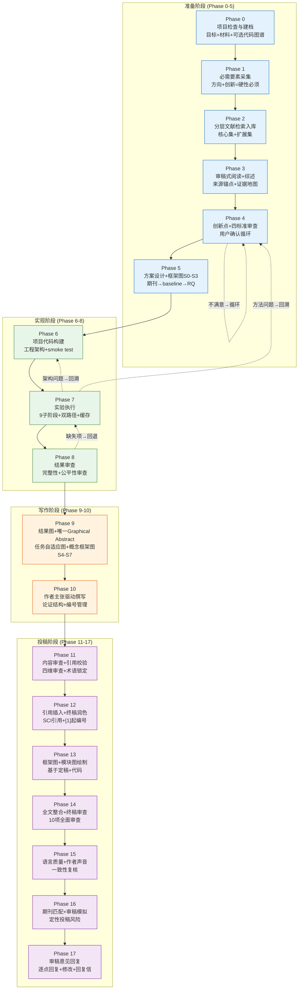

# 论文工作流 v6.0 · 对话式 · 18 Phase · 审稿人倒推与技能路由

> **版本**：v6.0 · 2026-07-15 · 基于v5完整增强
> **设计理念**：对话式引导，非自动化流水线。AI 是合作者，不是 checklist 执行器。
> **适用范围**：CV / NLP / LLM / KG / Medical AI / PHM / Time Series / RL / Speech / Tabular ML
> **框架无关**：PyTorch / TensorFlow / JAX / NumPy 均可
> **基于**：工作流问题记录 v1.0 全量实测 + 假设测试

---

## 全局规则

1. **对话式，非流水线**：Phase 松耦合，用户可以跳转或回溯；但涉及学术真实性、数据完整性、证据充分性和投稿合规性的质量门禁不得跳过。跳转前必须记录前置门禁状态和未解决风险。
2. **每 Phase 结束强制工作记录**：自动保存到 `docs/项目工作阶段记录/Phase{N}_{name}.md`。
3. **技能按需调用**：每个 Phase 列出推荐技能，AI 根据实际情况选用。
4. **用户确认是关键节点**：重大决策（创新点确认、实验范围、投稿）必须经用户确认。
5. **受限 fallback**：工程脚手架和接口占位允许使用 Stub；Stub、模拟值和未运行代码不得进入实验排名、统计结论、论文图表或投稿证据。缺失关键证据时必须停止相应结论并标记 `MISSING`。
6. **目录约束**：论文材料保存在 `docs/`，结构化实验结果保存在 `results/`，运行日志保存在 `logs/`，可再生缓存保存在 `cache/`，代码理解状态保存在 `.understand-anything/`。禁止在这些约定目录之外散落产物。
7. **规则优先级**：`SKILL.md` 的真实性边界与安全规则 > 本文件v6增强规则和质量门禁 > `references/phase-skill-routing.md` > 各Phase继承自v5的流程描述。发生冲突时必须执行高优先级规则。

---

## v6 增强层：不改变v5骨架的执行升级

v6保留v5的18个Phase和核心回溯逻辑，同时直接修复不再适用的旧表述。以下增强规则对各Phase中的历史描述具有覆盖效力：

1. **技能真实可调用**：每个Phase设一个主技能，辅助技能只在条件命中时加载；完整路由见 `references/phase-skill-routing.md`。
2. **审稿人倒推**：研究问题、创新点、实验和写作都必须回答“重要性、创新性、证据充分性、边界条件、期刊匹配度”。
3. **三类问题分流**：表达问题可直接改；论证问题需重构；证据问题必须补分析、实验或来源，禁止用润色掩盖。
4. **四态证据标签**：`SUPPORTED`、`INFERRED`、`VERIFY`、`MISSING`。
5. **领域驱动创新**：交叉AI创新按“真实失败 → 领域机制/约束 → 模型或研究设计 → 判别实验 → 有边界结论”审查。
6. **写作升级**：先锁定核心主张、证据和边界，再用 `nature-writing` 重构；只有逻辑通过后才调用 `nature-polishing`。
7. **引用与数据真实性**：引用必须核验支撑等级；数据可用性、仓库和标识符不得编造。
8. **禁止伪优化**：不以规避AI检测器为目标，不生成伪精确录用概率，不把包装当作科学贡献。

### 通用技能调用协议

每次执行Phase时按以下顺序：

`识别Phase/命令 → 读取主技能SKILL.md → 检查入口条件 → 读取必要reference → 执行当前范围 → 记录技能与产物 → 给出下一合法步骤`

- 不自动串联相邻Phase。
- 技能不可用时标记 `SKILL_UNAVAILABLE` 并执行有边界的人工回退。
- 输入不足时标记 `AUTHOR_INPUT_NEEDED`，不得猜测。
- 外部ZIP文件不视为已安装技能。

### 写作与润色总门禁

| 草稿状态 | 执行技能 | 处理方式 |
|---|---|---|
| 核心主张、证据或边界缺失 | `nature-writing` | 只生成结构和占位符，先暴露科学缺口 |
| 章节结构或段落任务混乱 | `nature-writing` | 重构论证架构 |
| 逻辑完整但语言粗糙 | `nature-polishing` | 精修语言，不改变技术含义 |
| 论断需要文献支撑 | `nature-citation` | 分段、检索、核验支撑等级 |
| 需要回到来源论文 | `nature-reader` | 保留页码、段落和图表锚点 |
| 需要回复真实审稿意见 | `nature-response` | 生成可追踪逐点回复包 |

---
## 工作流 Mermaid 图



---

## Phase 总览

| Phase | 阶段 | 名称 | 核心产出 | 关键技能 |
|-------|------|------|---------|---------|
| 0 | 准备 | 项目检查与建档 | 项目模型+材料清单 | world-model；understand条件调用 |
| 1 | 准备 | 必需要素采集 | 问题+术语+边界 | domain-modeling；grilling条件调用 |
| 2 | 准备 | 分层文献检索入库 | 核心文献集+扩展文献集 | nature-academic-search；nature-citation条件调用 |
| 3 | 准备 | 审稿式阅读+综述 | 来源锚点+证据地图+综述 | nature-reader；nature-writing条件调用 |
| 4 | 准备 | 创新点+四标准审查 | 创新分类+领域偏置地图 | world-model；domain-modeling条件调用 |
| 5 | 准备 | 方案设计+概念框架图S0-S3 | RQ+baseline+协议+概念图方向 | world-model；paper-framework条件调用 |
| 6 | 实现 | 项目代码构建 | 工程架构+测试+smoke | codebase-design；tdd/python-expert条件调用 |
| 7 | 实现 | 实验执行 | 任务自适应实验数据 | python-expert；diagnosing-bugs条件调用 |
| 8 | 实现 | 结果与证据审查 | 主张证据矩阵+复现报告 | world-model；understand-diff条件调用 |
| 9 | 写作 | 结果图+唯一图文摘要 | 出版级图表+概念框架终稿+GA | nature-figure；paper-framework条件调用 |
| 10 | 写作 | 作者主张驱动撰写 | 完整初稿+主张证据表 | nature-writing；reader/citation条件调用 |
| 11 | 投稿 | 三视角内容审查 | 审稿报告+术语表+风险清单 | nature-writing；world-model/citation/data条件调用 |
| 12 | 投稿 | 引用核验+结构化润色 | 引用可信的修订稿 | nature-polishing；writing/citation/data条件调用 |
| 13 | 投稿 | 终稿框架图项目 | 独立final图项目S0-S7 | paper-framework；nature-figure条件调用 |
| 14 | 投稿 | 全文整合+终稿审查 | 一致性审查通过+投稿包 | world-model；writing/citation/data条件调用 |
| 15 | 投稿 | 语言质量+作者声音 | 语言终稿+一致性复核 | nature-polishing；writing/domain-modeling条件调用 |
| 16 | 投稿 | 期刊匹配+审稿模拟 | 定性投稿风险+决策建议 | world-model；writing/search条件调用 |
| 17 | 投稿 | 审稿意见回复 | 可追踪回复包+修改稿 | nature-response；writing/polishing/citation条件调用 |

---

## 技能库总索引

### 技能等级

| 等级 | 技能群 | 用途 |
|------|--------|------|
| **论文** | nature-skills | 检索、阅读、写作、润色、引用、数据、图表、PPT和审稿回复 |
| **代码** | code-understanding | 条件式代码理解、差异分析和故障诊断 |
| **工程** | architecture-engineering | 领域建模、模块设计和测试驱动开发 |
| **决策** | world-model-method | 复杂方案比较、决策和审查 |
| **框架图** | paper-framework-figure-studio-pro | 严格逐回合S0-S7论文框架图流程 |
| **编码护栏** | karpathy-guidelines | 简洁、可验证、最小范围的代码修改 |
| **Python** | python-expert | 模型、训练、评估和实验实现 |

### 技能 × Phase 完整映射

| Phase | 主技能 | 条件辅助技能 |
|-------|--------|--------------|
| 0 | world-model-method | understand |
| 1 | domain-modeling | grilling |
| 2 | nature-academic-search | nature-citation |
| 3 | nature-reader | nature-writing, nature-paper2ppt |
| 4 | world-model-method | domain-modeling, nature-writing |
| 5 | world-model-method | domain-modeling, paper-framework-figure-studio-pro |
| 6 | codebase-design | tdd, python-expert, karpathy-guidelines, understand |
| 7 | python-expert | diagnosing-bugs, tdd, karpathy-guidelines |
| 8 | world-model-method | understand-diff, tdd |
| 9 | nature-figure | paper-framework-figure-studio-pro |
| 10 | nature-writing | nature-reader, nature-citation, domain-modeling |
| 11 | nature-writing | world-model-method, nature-citation, nature-data |
| 12 | nature-polishing | nature-writing, nature-citation, nature-data |
| 13 | paper-framework-figure-studio-pro | nature-figure |
| 14 | world-model-method | nature-writing, nature-citation, nature-data |
| 15 | nature-polishing | nature-writing, domain-modeling |
| 16 | world-model-method | nature-writing, nature-academic-search |
| 17 | nature-response | nature-writing, nature-polishing, nature-citation |

> ● = 主要使用  ○ = 辅助使用

---

## 技能路径索引

所有路径相对于 `Paper-gogo/` 根目录：

```text
Paper-gogo/
├── nature-skills/                         # 检索、阅读、写作、润色、引用、数据、图表、PPT、回复
├── code-understanding/                    # 条件式代码理解、diff和故障诊断
├── architecture-engineering/              # 领域建模、模块设计、TDD
├── world-model-method/                    # 复杂规划和审查
├── paper-framework-figure-studio-pro/     # 严格逐回合S0-S7框架图
├── karpathy-guidelines/                   # 编码护栏
├── python-expert/                         # Python实验实现
├── code_assets/                           # 可复用实验模板
└── references/phase-skill-routing.md      # 权威执行路由
```

外部ZIP仅是候选资源，不属于默认运行时。只有解压为目录且存在可读取的 `SKILL.md` 后，才能进入技能路由。

---

## Phase 详细设计

### Phase 0：项目检查

**目标**：搞清楚"我现在有什么"。

**流程**：
1. 扫描项目目录结构和所有文件
2. 有代码 → 先做依赖预检；`understand` 可用时生成代码知识图谱，不可用时执行范围受限的目录/入口/依赖清点；无代码 → 记录"项目为零起点"
3. 向用户汇报结构化摘要：项目类型/任务类型/数据集/核心模型/参考来源/缺失项

**产出**：`docs/项目工作阶段记录/Phase0_项目检查.md`；仅在 `understand` 实际成功运行时生成 `.understand-anything/`

**技能**：`world-model-method`；`understand`（条件调用）


#### v6 增强执行块

**v6 本地执行路由**：主技能 `world-model-method`；存在大型代码项目且 `understand` 的 plugin/Node/agent 预检通过时，才辅助调用 `understand`。

**记录**：目标、约束、材料清单、调用技能、缺失输入。

---

### Phase 1：必需要素采集

**目标**：确认用户知道自己要做什么。

**流程**：AI 逐项询问——

| 问题 | 要求 |
|------|------|
| "研究方向？" | **硬性必须** |
| "研究问题/真实困惑？" | **硬性必须** |
| "候选创新点？" | 可暂定，Phase 4 经检索后确认 |
| "参考论文？" | 强烈推荐 |
| "参考代码？" | 强烈推荐 |

用户说不清楚 → AI 帮理清思路，不能跳过。

**产出**：`docs/项目工作阶段记录/Phase1_要素采集.md`


#### v6 增强执行块

**v6 本地执行路由**：主技能 `domain-modeling`；术语、边界或假设仍模糊且用户接受访谈时，辅助调用 `grilling`。

**新增门禁**：研究问题必须完成“现象—机制—条件”三层表达。

---

### Phase 2：文献检索与入库

**目标**：建立与研究问题匹配、可追溯的分层文献库；数量由领域成熟度与论文类型决定，不以固定篇数替代覆盖度。

**流程**：
1. 审查用户提供的内容
2. nature-reader 解析用户提供的论文 → .md
3. 如有参考代码 → 按 Phase 0 的条件路由处理
4. nature-academic-search 多源检索，建立“核心集 + 扩展集”：核心集通常 8–15 篇，扩展集持续补充；偏离该范围时记录理由
5. 对话：手动下载 or 自动下载？
6. PDF → md（硬性要求：双栏/单栏兼容 + 全文文字 + 图表完整 + 参考文献逐条保留）
7. 文献入库 `docs/参考文献/*.md`

**产出**：`docs/参考文献/*.md`、`docs/参考文献/文献分层表.md`、`docs/{Project}_BibTeX.bib`

**技能**：`nature-academic-search`；`nature-reader`、`nature-citation`（条件调用）


#### v6 增强执行块

**v6 本地执行路由**：主技能 `nature-academic-search`；需要逐句补引用或导出ENW/RIS/RDF时调用 `nature-citation`。

**新增门禁**：所有“首次、领先、尚未解决”进入 `VERIFY` 清单。

---

### Phase 3：全文阅读与综述生成

**目标**：审稿式阅读核心文献并综合扩展文献，形成可核验的证据地图和综述草稿。

**硬性约束**：核心集逐篇全文深读；扩展集先读元数据/摘要/关键图表，发现直接相关、冲突证据或关键方法时升级为核心集。所有结论保留来源锚点，不把摘要级信息伪装成全文结论。

**流程**：
1. nature-reader 对核心集逐篇深度阅读 → 提取：问题/方法/创新/实验/结论/局限
2. nature-writing 整合 → 按主题/方法/时间线多维度组织
3. 标注每篇 gap 和贡献
4. 保存 `docs/综述/学术综述.md`

**产出**：`docs/综述/学术综述.md`

**技能**：`nature-reader`；`nature-writing`、`nature-paper2ppt`（条件调用）


#### v6 增强执行块

**v6 本地执行路由**：主技能 `nature-reader`，生成带来源锚点的完整阅读产物；用户明确要组会汇报时再调用 `nature-paper2ppt` 生成真实PPTX。

**新增输出**：核心问题、贡献、关键假设、证据链、弱点、必读/可略读部分。

---

### Phase 4：创新点识别与审查

**目标**：基于综述 gap，识别真正的创新点，严格审查。

**流程**：
1. 基于综述生成创新点（>= 1 条真实即可，不追求数量）
2. 多技能交叉验证 → 四标准审查
3. 生成审查报告
4. 用户确认循环（不满意 → 改 → 再审 → 循环直到满意）

**四标准审查**：

| 审查项 | 标准 | 不达标 |
|--------|------|--------|
| 模块堆砌检测 | A+B+C 拼凑 or 本质新机制？ | 直接退回 |
| 真实创新性 | 与现有工作本质区别？ | 退回 |
| 目标期刊贡献门槛 | 对标已核验的目标期刊范围及近年同类论文贡献幅度 | 退回或降级主张 |
| 实验可实现性 | 算力/数据/复杂度合理？ | 退回 |

**产出**：`docs/创新点表.md`、`docs/创新点/审查报告.md`

**技能**：`world-model-method`；`domain-modeling`、`nature-writing`（条件调用）


#### v6 增强执行块

**v6 本地执行路由**：主技能 `world-model-method`；领域术语与约束用 `domain-modeling`；主张—证据审查使用 `nature-writing` 的 `paper-review.md`。

**新增门禁**：通用注意力、残差、位置编码或模型替换不得单独计为交叉创新。

---

### Phase 5：方案设计 + 框架图 S0-S3

**目标**：把创新点落地为可执行的实验方案。

**流程**：
1. 期刊候选（文献相似度仅作初筛；scope、文章类型、格式与政策必须以当前官方 Author Guidelines/Guide for Authors 核验 → Top-5 + 改投代价）
2. Baseline 清单（从综述提取 SOTA 方法）
3. 实验协议正式化（数据集/split/seeds/显著性检验/成功判据）
4. RQ 定义（nature-writing 驱动，对齐目标期刊风格）
5. 验证方案设计（每个假设 → 实验 + ablation + 预期结果）
6. 目标期刊对齐审查
7. 多技能审查 + 用户确认
8. ★ 概念框架图项目 S0-S3（paper-framework-figure-studio-pro，项目 ID：`framework-concept`）

**框架图 S0-S3**：
- S0：建立项目状态，确认材料/画幅
- S1：诊断读者问题、figure 角色、核心创新点
- S2：生成 6-8 张低保真手绘草图（快速迭代确认架构合理性）
- S3：选择最强方向 → 用户确认

**产出**：`docs/journal_profile.md`、`docs/baseline_清单.md`、`docs/实验协议.md`、`docs/RQ.md`

**技能**：`world-model-method`；`domain-modeling`、`nature-academic-search`、`paper-framework-figure-studio-pro`（条件调用）


#### v6 增强执行块

**v6 本地执行路由**：主技能 `world-model-method`；领域规则用 `domain-modeling`；框架图只在用户明确请求具体S阶段时调用 `paper-framework-figure-studio-pro`。

**强制约束**：框架图S0-S3每个用户回合最多执行一步，禁止自动推进。

---

### Phase 6：项目代码构建

**目标**：按真实工程架构构建项目代码。

**核心原则**：工程架构优先 + 有参考项目则参考 + 模块化/可测试/可配置。

**流程**：
1. 架构设计（分析参考项目 → codebase-design 设计模块）
2. 项目骨架（目录结构 + config + .gitignore；只有用户明确同意时才 `git init`）
3. 核心模块实现（数据管线 + 模型 + Trainer + 评估，karpathy 把关）
4. Baseline 实现（逐个实现；缺失依赖时只允许建立接口 stub，必须标记 `NON_EVALUABLE`，不得进入实验结果或排名）
5. Smoke Test（forward+backward 通过）
6. Work record

**工程项目结构**：
```
{project}/
├── models/  configs/  data/  train/  eval/
├── baselines/  utils/  experiments/  tests/  docs/
```

**产出**：完整项目代码、smoke test PASS

**技能**：`codebase-design`；`tdd`、`python-expert`、`karpathy-guidelines`、`understand`（条件调用）


#### v6 增强执行块

**v6 本地执行路由**：主技能 `codebase-design`；行为变更调用 `tdd`；Python实现调用 `python-expert`；全程应用 `karpathy-guidelines`。

**条件辅助**：只有依赖预检通过才调用 `understand`；否则采用范围受限的直接代码检查。

---

### Phase 7：实验执行

> 整个工作流中耗时最长、最关键的阶段。

**入口对话**：公开 benchmark？自有数据集？公开数据+自定义协议？

**子阶段**：

| 子阶段 | 名称 | 优先级 | 论文对应 |
|--------|------|--------|---------|
| 7A | 实验设置 | P0 | Experimental Setup |
| 7B | 主实验结果 | P0 | Main Results |
| 7C | 消融/机制验证 | P0（存在可分解设计或机制主张时） | Ablation / Mechanism Studies |
| 7D | 超参敏感度 | P1 | Hyperparameter Analysis |
| 7E | 鲁棒性分析 | 主张包含鲁棒性时 P0，否则 P1 | Robustness |
| 7F | 泛化实验 ★ | 主张包含泛化时 P0，否则 P1 | Generalization |
| 7G | 效率分析 | P1 | Efficiency |
| 7H | 定性分析 | P1 | Qualitative Analysis |
| 7I | 汇总出表 | P0 | Tables & Figures |

**泛化实验（7F）**：

| 类型 | 操作 | 优先级 |
|------|------|--------|
| 跨数据集 | A训→B测 | 有可比数据且主张跨域泛化时 P0 |
| 跨场景 | 场景1→场景2 | P1 |
| 少样本迁移 | 10%/25%/50% finetune | P1 |
| 跨时间/跨传感器 | 视数据 | 可选 |

**控制台输出规范**（字段由任务适配器声明；下列分类指标仅为示例）：

- 总横幅：`╔══ P H A S E   7 ══╗` + `████` 分隔
- 子阶段横幅：`╔══ PHASE 7A ══╗` + 实验数/模型列表
- 每 epoch：训练/验证目标、该任务主指标、学习率、耗时、资源与 ETA；不适用字段不强填
- 实验完成：最佳轮次、任务主/辅指标、复杂度、耗时、停止原因和种子；分类任务可使用 Acc/F1/Precision/Recall
- 中期排名表：ASCII 表格
- stdout 双写：控制台 + `logs/{sub}_{ts}.stdout/.jsonl`
- 错误日志：追加写入 `logs/{sub}_errors.log`

**数据缓存机制**：首次加载与预处理 → 写入带数据版本、预处理参数和 split 哈希的缓存；后续命中缓存时记录实际耗时，不预设固定加速数字。

**长任务处理**：预计 >5min 时使用当前环境支持的后台任务/实验队列与监控机制；若环境不支持，则返回可恢复命令和状态文件，不假设存在 `ScheduleWakeup`。

**回溯决策**：小修原地 / 架构回 Phase 6 / 方法回 Phase 4。

**产出**：`results/phase7_full.json`、`results/tables/*.tex`、`results/phase7_figure_data.json`、`logs/`

**技能**：`python-expert`、`world-model-method`


#### v6 增强执行块

**v6 本地执行路由**：主技能 `python-expert`；运行失败、性能回退或非确定性问题调用 `diagnosing-bugs`；需要锁定行为时调用 `tdd`。

**新增门禁**：失败诊断必须先建立可变红的反馈循环，再形成根因假设。

**真实性门禁**：stub、模拟数据和未完成运行必须标记 `NON_EVALUABLE`，不得进入主表、排名、统计检验或论文主张。

---

### Phase 8：结果审查与复现验证

**目标**：在写论文前确认结果站得住。本阶段只审计；发现证据缺口时回退 Phase 7 补实验并重新审计。

**流程**：
1. 结果完整性检查 → FAIL 时自动生成回退清单（映射到 Phase 7 子阶段）
2. 代码扫描（8 项标准 checklist：死代码/数据泄漏/配置一致性/硬编码路径/种子固定/训练测试分离/标签泄漏/数据增强一致性）
3. 公平性审查（baseline 调参？同等条件？过拟合？cherry-pick？已发表对比？）→ 每个 WARN/FAIL 附具体建议
4. Checklist 归档
5. 用户确认（每个 WARN/FAIL 给选项：接受/回退修复/标注理由跳过）

**产出**：`results/复现_checklist.md`、`results/审查报告.md`

**技能**：`world-model-method`；`understand-diff`、`tdd`（条件调用）


#### v6 增强执行块

**v6 本地执行路由**：主技能 `world-model-method`；代码变更审查可调用 `understand-diff`；复现缺陷可调用 `tdd`。

**新增输出**：主张—证据矩阵、泄漏风险、基线公平性、替代解释和允许的结论措辞。

---

### Phase 9：可视化与 Graphical Abstract

**流程**：
1. 任务类型检测 → 自动匹配图清单（分类/回归/检测/分割/生成各不同）
2. nature-figure 生成结果图（三格式 + 期刊风格）
3. 每张正文图生成 figure brief、caption、legend 和正文引用句 → `docs/figure/fig{N}/fig{N}_brief.md`
4. 继续 `framework-concept` 项目 S4-S7（S4:候选简报 → S5:正式候选 → S6:选择 → S7:审计 PASS）
5. 期刊风格审查 + caption 检查
6. 若目标期刊要求，基于整篇论文另生成且仅生成 1 份 Graphical Abstract；它是独立投稿资产，不等同于正文逐图说明

**Figure brief 模板**：图的任务 + 数据来源 + 编码规则 + 核心发现 + 不确定性/统计信息 + Caption + 正文引用句。

**Graphical Abstract 模板**：研究问题 + 方法主线 + 核心发现 + 适用边界；不得塞入所有正文图。

**门禁**：图的数量服从论证需要；所有实际使用的图通过数据一致性、可读性、caption 与正文交叉引用检查。若生成概念框架图，则其 S7 必须 PASS。

**产出**：`docs/figure/fig{N}/*.{pdf,svg,png}`、`docs/figure/fig{N}/fig{N}_brief.md`；可选 `docs/投稿/graphical_abstract.{pdf,svg,png}`

**技能**：`nature-figure`；`paper-framework-figure-studio-pro`（条件调用，S4-S7）


#### v6 增强执行块

**v6 本地执行路由**：数据结果图调用 `nature-figure`；方法框架图调用 `paper-framework-figure-studio-pro`。

**强制入口**：`nature-figure` 未指定Python或R时必须先询问并停止；框架图每回合只执行一个明确S步骤。

---

### Phase 10：论文撰写

**流程**：
1. 图表布局 + 全局编号分配（Figure/Table/Equation 编号锁定 → `numbering_register.md`）
2. 参考文献论证结构分析：只提取可概括的修辞动作、论证顺序和证据组织方式 → `论证结构库.md`；禁止复制或近似改写他人有辨识度的句子
3. 逐 section 撰写（Abstract/Intro/RelatedWork/Method/Experiments/Discussion/Conclusion）
4. 全文组装 + 交叉引用校验（图/表/公式/引用/数据数字）
5. 一致性审查 + 用户确认

**硬性约束**：作者提供或确认核心主张、证据、边界与关键判断；`nature-writing` 负责结构化和起草。数字只从通过 Phase 8 审计的结果注入，正文图描述只从对应 figure brief/caption 生成。

**产出**：`docs/论文/{Project}_Paper_v1.tex`、`docs/论文/numbering_register.md`、`docs/论文/论证结构库.md`

**技能**：`nature-writing`；`nature-reader`、`nature-citation`、`domain-modeling`（条件调用）


#### v6 增强执行块

**v6 本地执行路由**：主技能 `nature-writing`；来源回查用 `nature-reader`，引用核验用 `nature-citation`，术语锁定用 `domain-modeling`。

**撰写升级**：先写一句总论证，再为每段分配唯一任务；摘要采用“问题—困难—方法—结果—意义—边界”，引言从困惑/矛盾开始，相关工作组织成学术对话，方法解释为什么这样设计，结果翻译数据而非复述表格。

**章节references**：按需读取 `abstract.md`、`introduction.md`、`related-work.md`、`method.md`、`experiments.md`、`conclusion.md`，不得一次性加载无关材料。

**产出升级**：每节同时输出主张—证据表、假设/缺失输入和允许的措辞强度。

---

### Phase 11：内容审查 + 引用校验

**流程**：
1. ★ 论文内容审查（先审内容，再审格式）：
   - 创新点-实验-结论对齐审查
   - 论点-数据支撑审查（每个定量断言 vs Phase 7 JSON）
   - 逻辑链审查（Abstract→Intro→Method→Exp→Conclusion 自洽？）
   - 过度宣称检测（"SOTA""first""robust"→有数据支撑？）
2. 术语表提取 + 锁定（润色前锁死 LOCK 项）
3. 参考文献校验（领域核心工作、直接证据与关键反例覆盖；数量不设统一下限）
4. 期刊特定 Checklist（先读 Author Guidelines）

**产出**：`docs/论文/内容审查报告.md`、`docs/论文/术语表.md`

**技能**：`nature-writing`；`world-model-method`、`nature-citation`、`nature-data`（条件调用）


#### v6 增强执行块

**v6 本地执行路由**：主技能 `nature-writing` 并读取 `paper-review.md`；复杂权衡调用 `world-model-method`；引用调用 `nature-citation`；数据声明调用 `nature-data`。

**审稿升级**：分别模拟创新/重要性、方法/实验/复现、结构/写作/期刊匹配三种审稿视角，并分离作者公开意见和编辑私密风险。

---

### Phase 12：引用插入 + 终稿润色

**流程**：
1. 审查结果落地修改（逐条处理 Phase 11 的 FAIL/WARN）
2. ★ 参考文献正文插入：
   - 引用需求分析（扫描正文标记引用位置）
   - 引用匹配（按直接支持度、来源质量、领域权威性和时效性选择；不使用跨学科通用的“SCI>会议>arXiv”机械排序）
   - 按行文逻辑 [1] 起顺序编号，同篇复用同号
   - 插入正文 + refs.bib 重排
3. 引用-正文一致性校验
4. 最终润色（nature-polishing 三层，术语锁定下执行）

**产出**：`docs/论文/{Project}_Paper_final.tex`、`docs/参考文献/refs.bib`（按[1]~[N]排序）

**技能**：`nature-polishing`；`nature-writing`、`nature-citation`、`nature-data`（条件调用）


#### v6 增强执行块

**v6 本地执行路由**：主技能 `nature-polishing`；若结构仍有问题先回 `nature-writing`；引用用 `nature-citation`；数据可用性用 `nature-data`。

**润色升级顺序**：论文类型 → 章节任务 → 段落逻辑 → 主张/证据/边界 → 句子语言。逻辑未通过时禁止只做表面语言美化。

**输出升级**：修改稿、修改依据、证据边界、引用核验状态和修改台账。

---

### Phase 13：框架图 + 模块图绘制

**流程**：
1. 全文深度理解（读取 Phase 0-12 工作记录 + 定稿 + 代码）
2. 新建独立终稿框架图项目 `framework-final`，不得复用 Phase 5/9 的状态；基于最终定稿严格执行 S0-S7
3. 仅在论证需要时绘制模块详图；定量子图调用 nature-figure，不强制“每模块一张”
4. 图表-正文交叉校验
5. 终稿图表嵌入

**模块图标准**：输入标注 + 内部结构 + 输出标注 + 关键公式 + 创新点标注

**产出**：`docs/figure/fig_framework_final.{pdf,svg,png}`、`docs/figure/fig_module_{1-N}_*.{pdf,svg,png}`

**技能**：`paper-framework-figure-studio-pro`；`nature-figure`（条件调用）


#### v6 增强执行块

**v6 本地执行路由**：主技能 `paper-framework-figure-studio-pro`；定量子图才辅助调用 `nature-figure`。

**强制约束**：`framework-final` 严格 S0→S7 逐回合执行，每回合最多一步；S7必须联合审查最终图、caption、legend和正文引用句后才能完成。

---

### Phase 14：全文整合 + 终稿审查

**目标**：整合所有正文图表与独立投稿资产，完成 10 项全面审查。

**流程**：
1. 图表最终整合（正文只嵌入论文图表；唯一 Graphical Abstract 作为独立投稿资产按期刊要求提交）
2. 全文完整性审查（结构/章节/图表/公式/引用 是否缺漏）
3. 图表正确性审查（编号/标题/caption/交叉引用）
4. 参考文献正确性审查（逐条：存在？编号一致？条目完整？）
5. 参考文献顺序审查（[1]→[N] 首次出现顺序？同篇复用同号？）
6. 数据-正文一致性审查（最后一轮：每个定量数字 vs Phase 7 JSON）
7. 术语-公式-代码一致性（23 LOCK 项三方对齐）
8. 排版格式审查（期刊模板/页数/图表分辨率/字体/行距）
9. 投稿包生成
10. 最终审查报告 + 用户确认

**产出**：`docs/论文/{Project}_Paper_FINAL.tex/.pdf`、`docs/投稿/submission_package/`

**技能**：`world-model-method`；`nature-writing`、`nature-citation`、`nature-data`（条件调用）


#### v6 增强执行块

**v6 本地执行路由**：主技能 `world-model-method`；全文自审使用 `nature-writing` 的 `paper-review.md`；引用和数据分别调用 `nature-citation`、`nature-data`。

**新增门禁**：标题、摘要、Highlights、图表、正文、补充材料和结论中的每个强主张必须一致。

---

### Phase 15：语言质量与作者声音

**流程**：
1. 按章节任务检查准确性、清晰度、简洁度、连贯性与期刊语域
2. 识别模板化空话、机械连接、句式单调、夸张修饰和作者声音丢失，按问题严重度局部或整节润色
3. 保留作者的技术判断、限定语和领域习惯，不为了“像人写”而随机改句
4. 改写后对术语、数据、引用、图表、因果强度和主张边界重新核对
5. 最终投稿检查 + 用户确认

**语言质量检查清单**：

| 维度 | 判定问题 |
|------|----------|
| 准确 | 是否改变技术含义、因果强度或证据边界？ |
| 简洁 | 是否存在不承担论证任务的句子或重复信息？ |
| 连贯 | 段内句子是否围绕唯一任务推进？段间关系是否明确？ |
| 专业 | 术语、符号、时态、语态是否符合领域与目标期刊？ |
| 作者声音 | 关键判断、限定语和风格是否仍由作者确认？ |

**产出**：`docs/论文/{Project}_Paper_FINAL_v3.tex/.pdf`、`docs/论文/语言质量报告.md`

**技能**：`nature-polishing`；`nature-writing`、`domain-modeling`（条件调用）


#### v6 增强执行块

**v6 本地执行路由**：主技能 `nature-polishing`；章节逻辑破损时回 `nature-writing`；术语漂移时调用 `domain-modeling`。

**润色升级目标**：准确、简洁、连贯、专业并保留作者声音；删除模板化空话和宣传措辞。本阶段不提供“去AI率”或规避检测器服务。

**复核**：任何改写后重新检查数据、术语、引用、图表和因果强度。

---

### Phase 16：期刊匹配 + 审稿模拟

**流程**：
1. 期刊匹配度审查（8 维 editorial 视角：scope/方法/创新/实验/baseline/写作/图表/引用）
2. 桌拒风险评估（高/中/低，并列出可观察依据与不确定性）
3. 审稿人模拟（3 位不同类型：方法专家/应用专家/理论专家，完整审稿意见）
4. 处理建议（Reject/Major/Minor/Accept 模拟判断，仅作投稿前压力测试）
5. 投稿前改进清单（按证据风险、可修复性与投入排序，不承诺概率提升）
6. 用户决策（[A]修高优投 [B]全修投 [C]不修投 [D]换期刊）

**产出**：`docs/投稿/期刊匹配报告.md`、`docs/投稿/模拟审稿意见.md`、`docs/投稿/投稿风险评估.md`

**技能**：`world-model-method`；`nature-writing`、`nature-academic-search`（条件调用）


#### v6 增强执行块

**v6 本地执行路由**：主技能 `world-model-method`；全文审稿依据使用 `nature-writing` 的 `paper-review.md`；需要比较目标领域文献时调用 `nature-academic-search`。

**决策升级**：输出定性桌拒风险、Reject/Major/Minor/Accept建议和转投条件；不生成伪精确录用概率。当前期刊政策必须以经核验的官方要求为准。

---

### Phase 17：审稿意见回复

**触发条件**：论文投稿后收到真实审稿意见。

**流程**：
1. 审稿意见解析+分类（提取→分类 Major/Minor/Suggestion→标注严重程度）
2. 回复策略规划（逐条：接受并修改/澄清解释/基于证据礼貌商榷；不得无证据硬拒，也不得为了迎合接受错误前提）
3. 逐点回复生成（每条→完整回复正文→修改方案→修改位置→OLD/NEW对照）
4. 论文修改执行
5. 修改对照表（OLD vs NEW，改动标蓝）
6. 回复信组装（nature-response 生成正式 response letter）
7. 回复策略指导（黄金法则：感谢→具体修改→标注位置 + 常见错误 + 时间管理）
8. 最终审查 + 用户确认

**审稿回复黄金法则**：
1. 态度：永远感谢审稿人
2. 优先解决问题；必要时用数据、文献或范围边界礼貌商榷
3. 每个回复三要素：感谢 + 说明修改（具体+位置）+ 证据
4. 修改标注：蓝色高亮，标注行号
5. 不要：只说"已修改"不说改了什么 / 遗漏任何一条 / 语气 defensive

**产出**：`docs/投稿/response_to_reviewers.md`、`docs/投稿/修改对照表.md`、`docs/论文/{Project}_Paper_REVISED.tex`

**技能**：`nature-response`；`nature-writing`、`nature-polishing`、`nature-citation`（条件调用）


#### v6 增强执行块

**v6 本地执行路由**：主技能 `nature-response`；正文重构用 `nature-writing`，语言精修用 `nature-polishing`，新增或争议引用用 `nature-citation`。

**强制输出**：评论ID、问题分类、响应动作、证据、修改位置、缺失作者输入和提交就绪状态。不得声称未完成的实验或修改已经完成。

---

## 控制台输出规范（Phase 7 专用）

### 总横幅

```
████████████████████████████████████████████████████████████████████████████████████████████████████
  ╔══════════════════════════════════════════════════════════════╗
  ║           P H A S E   7   实 验 核 心                       ║
  ║           Experiment Core  (P7A ~ P7I)                      ║
  ╚══════════════════════════════════════════════════════════════╝
████████████████████████████████████████████████████████████████████████████████████████████████████
```

### 子阶段横幅

```
████████████████████████████████████████████████████████████████████████████████████████████████████
  ╔======================================== PHASE 7A ========================================╗
  ║ 环境核查 + 全部 Baseline 训练                                                            ║
  ║ 计划实验数: 15                                                                           ║
  ║ 模型: CNN1D, ResNet1D, LSTM... 共15个 | Epochs=200                                       ║
  ╚==========================================================================================╝
████████████████████████████████████████████████████████████████████████████████████████████████████
```

### 每 Epoch（分类任务示例；其他任务替换指标字段）

```
[Epoch {cur:>4}/{total}]  TrainLoss={tl:.4f}  ValLoss={vl:.4f}  TrainAcc={ta:.4f}  ValAcc={va:.4f}  ValF1={vf:.4f}  BestValAcc={bva:.4f}(ep{be})  LR={lr:.2e}  EpTime={et:.1f}s  Total={tot:.0f}s  ETA={eta:.0f}s  GPU={mem:.0f}/{total_mem:.0f}MB
```

### 实验完成（分类任务示例；其他任务替换指标字段）

```
====================================================================================================
[实验完成] Model={name} | BestEp={be}/{te} | TestAcc={acc:.4f} | TestF1={f1:.4f} | Precision={p:.4f} | Recall={r:.4f} | Params={params:,} | FLOPs={flops:.2f}M | TrainTime={time:.1f}s | AvgEpTime={avg:.1f}s | Latency={lat:.2f}ms | EarlyStop@{stop}
====================================================================================================
```

### 中期排名表

```
PHASE 7A RESULTS (interim)
-------------------------------------------------------------------------------------------
Model                      Acc      F1 MacroF1  Params(K)   FLOPs(M)  Time(s)  ValBst  Rank
-------------------------------------------------------------------------------------------
{model}              {acc:.4f}  {f1:.4f}  {mf1:.4f}    {p:>8,.1f}  {fl:>10,.2f}  {t:>7,.1f}  {vb:.4f}  {r:>4}
  * = {ours} (Ours)；`NON_EVALUABLE` 项不得进入本表
```

---

## 数据缓存机制

### 缓存流程

```
首次运行: 数据加载→特征提取→预处理→写入带版本与split哈希的缓存（记录实测耗时）
后续运行: 校验数据/配置/split哈希→命中后加载（记录实测耗时与加速比）
```

### 缓存输出

```
>>> 构建数据集 ...
    [CACHE MISS] CSV加载中... 100%|████| 50000/50000
    [CACHE WRITE] 已写入: cache/dataset_X.npy (50000, 256)
    完成: X=(N, D)  耗时={measured_seconds}s (首次)

>>> 构建数据集 ...
    [CACHE HIT] 加载: cache/dataset_X.npy  耗时={measured_seconds}s
    [CACHE HIT] 加载: cache/dataset_y.npy  耗时={measured_seconds}s
    缓存命中: 2/2 | 总加载={measured_seconds}s | 加速比={measured_ratio}x
```

### 缓存目录

```
cache/
├── dataset_X.npy / dataset_y.npy
├── dataset_meta.json
├── split_train.json / split_val.json / split_test.json
```

**失效规则**：SHA 不匹配 or `--clear-cache` → 清除重建。

---

## 状态文件同步

| 文件 | 更新内容 |
|------|---------|
| `docs/README.md` | Phase 完成度/状态 |
| `docs/项目工作阶段记录/Phase{N}_{name}.md` | 完整阶段产出记录 |
| `results/phase7_progress.json` | Phase 7 实时进度 |
| `results/phase7_{sub}.json` | Phase 7 结构化结果 |
| `logs/{sub}_errors.log` | Phase 7 错误日志 |

---

*最后更新：2026-07-15 v6.0 增强版*
*基于：v5.0完整工作流 · 审稿人倒推 · 证据边界 · 本地技能执行路由*
